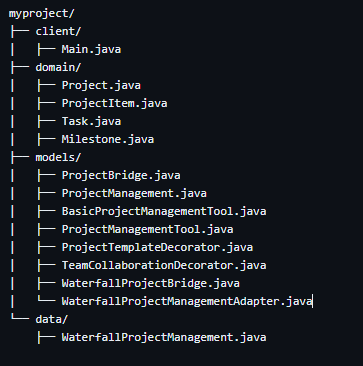
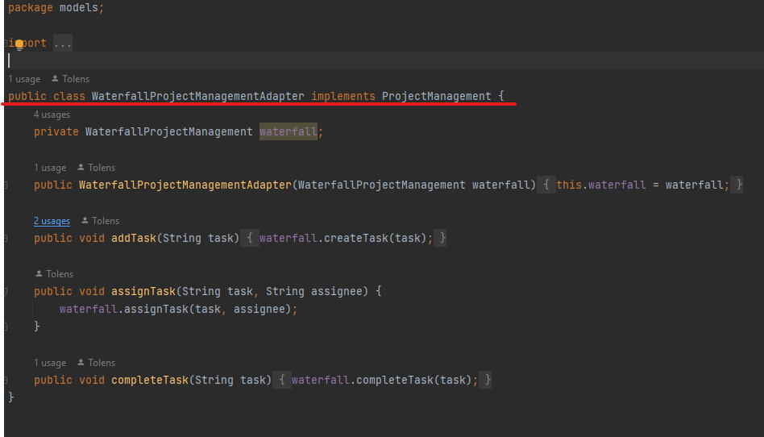
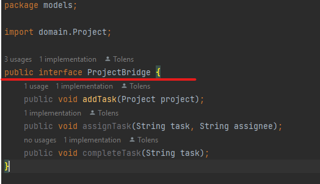
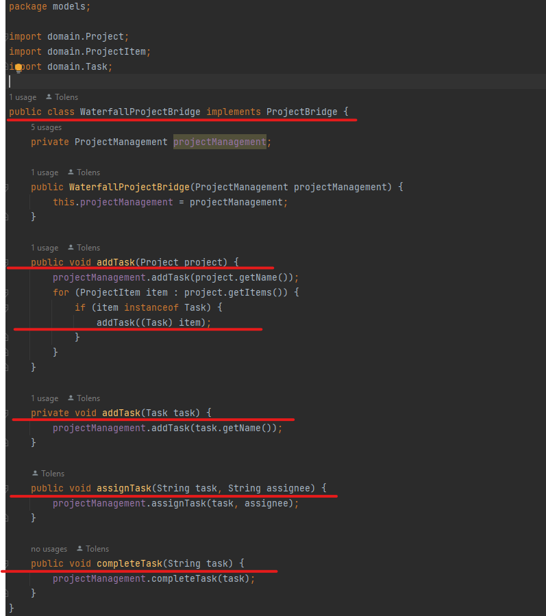
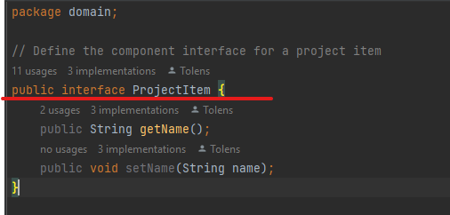
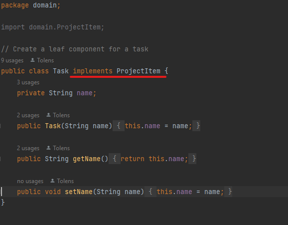
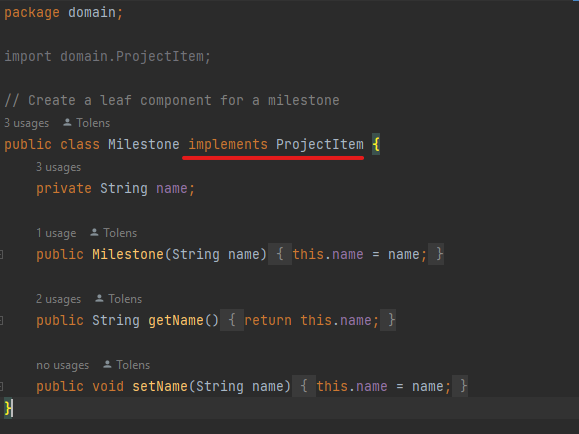
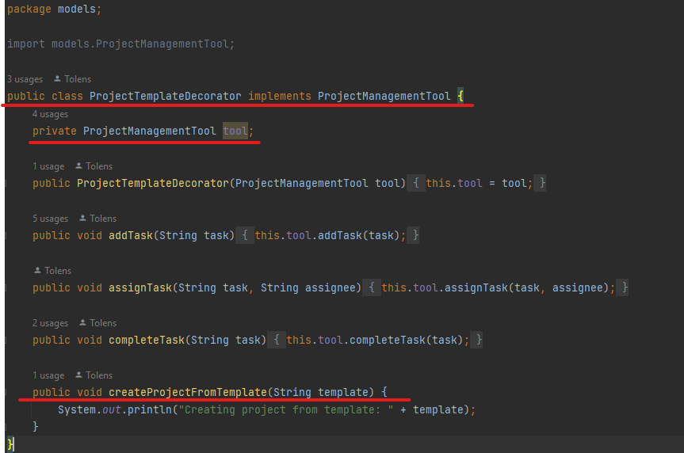
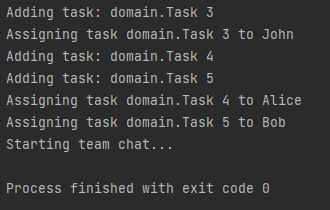

# About the app
The Employee Management System project is a software application that allows users to manage employees in a company. It uses various design patterns such as the Composite pattern for creating employee hierarchies, the Decorator pattern for adding additional functionality to employee objects, the Facade pattern for providing a simplified interface to the system, and the Flyweight pattern for reducing memory usage by sharing common data between objects. The system allows users to add, remove, and update employee data, perform performance reviews, and pay employees.

## Objectives

1. Study and understand the Structural Design Patterns.
2. As a continuation of the previous laboratory work,
   think about the functionalities that your system will need to provide to the user.
3. Implement some additional functionalities, or create a new project
   using structural design patterns.

## Used Design patterns

1. Adapter
2. Bridge
3. Composite
4. Decorator

## The app structure

## Implementation

### Adapter

In this class, we create a new adapter class that implements the ProjectManagement interface, which is the interface that our project management tool uses to interact with different project management systems.

### Bridge

The ProjectBridge class is the abstraction, and it defines the methods and properties that the clients of the class can use. In this case, the ProjectBridge class defines a method to get the project status.

### Composite

In this implementation, the ProjectItem class represents both tasks and milestones as a single object. It is a composite because it contains a collection of ProjectItem objects as children. The ProjectItem class also defines common methods for all its children, such as getting and setting the name of the item, getting the progress of the item, and adding and removing child items.

### Decorator
ProjectTemplateDecorator: this class is a decorator that adds the ability to create project templates to our project management tool.

## Result after execution

## Conclusion

The project management tool we developed using various design patterns is an excellent example of how software can improve the management of complex projects. With this tool, users can create and manage projects, tasks, and milestones, as well as assign and track progress of individual tasks.

In particular, the tool demonstrates the power of design patterns in creating a flexible, scalable, and maintainable solution to a complex problem. By leveraging patterns such as the adapter, bridge, composite, and decorator, we were able to create a software architecture that is modular and easy to extend, making it simple to add new features or make changes as project requirements evolve.

Moreover, the tool leverages object-oriented programming concepts such as inheritance, interfaces, and polymorphism to create a coherent and understandable codebase. This makes it easier for developers to maintain and improve the software over time.

In conclusion, the project management tool we developed is an excellent example of how design patterns and object-oriented programming can help developers create powerful and flexible software solutions to complex problems, and improve the efficiency and success of projects.